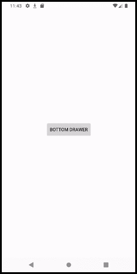

<h1 align="center">Bottom Drawer</h1>
<p align="center">Easy way to make Bottom Sheet with animation</p>
<p align="center"><a href="https://github.com/heyalex/BottomDrawer" target="_blank"></a></p>

## Usage
To customize Bottom Drawer you need to define a new style with extending BottomDialogTheme

You can use the following properties in your BottomDrawer Theme.

| Properties                                 | Type                              | Default |
| ------------------------                   | --------------------------------- | ------- |
| `should_draw_under_status_bar`             | boolean                           | false   |
| `should_draw_content_under_handle_view`    | boolean                           | false   |
| `bottom_sheet_corner_radius`               | dimension                         | 10dp    |
| `bottom_sheet_extra_padding`               | dimension                         | 4dp     |
| `bottom_drawer_background`                 | color                             | WHITE   |


It will be something like:
```xml
<style name="CustomTheme" parent="BottomDialogTheme">
      <item name="bottom_sheet_extra_padding">4dp</item>
      <item name="should_draw_under_status_bar">true</item>
</style>
```
You can make your own HandleView and implement TranslationUpdater interface for getting callbacks.
Or you can use defined handle views by library like PlainHandleView or PullHandleView (check sample app).

After customizing theme and choosing handle view, you need to override configureBottomDrawer method and pass theme, handle view to BottomDrawerFragment.

So the following example will make Google Tasks fragment like on main preview:
```kotlin
class GoogleTaskExampleDialog : BottomDrawerFragment() {

    override fun onCreateView(inflater: LayoutInflater, container: ViewGroup?, savedInstanceState: Bundle?): View? {
        super.onCreateView(inflater, container, savedInstanceState)
        return inflater.inflate(R.layout.your_layout, container, false)
    }

    override fun configureBottomDrawer(): BottomDrawerDialog {
        return BottomDrawerDialog.build(context!!) {
            theme = R.style.Plain
            //configure handle view
            handleView = PlainHandleView(context).apply {
                val widthHandle =
                    resources.getDimensionPixelSize(R.dimen.bottom_sheet_handle_width)
                val heightHandle =
                    resources.getDimensionPixelSize(R.dimen.bottom_sheet_handle_height)
                val params =
                    FrameLayout.LayoutParams(widthHandle, heightHandle, Gravity.CENTER_HORIZONTAL)

                params.topMargin =
                    resources.getDimensionPixelSize(R.dimen.bottom_sheet_handle_top_margin)

                layoutParams = params
            }
        }
    }
}
```


You also can change color and corner by code in BottomDrawerFragment:
```kotlin
changeCornerRadius(radius: Float)
changeBackgroundColor(color: Int)
```

## Integration

This library is available on **jitpack**, so you need to add this repository to your root build.gradle:

```groovy
allprojects {
    repositories {
        ...
        maven { url 'https://jitpack.io' }
    }
}
```

Add the dependency:

```groovy
dependencies {
    implementation 'com.github.HeyAlex:BottomDrawer:v1.0.0'
}
```

## Samples
You can find more samples in app module, to understand functionality of library.


